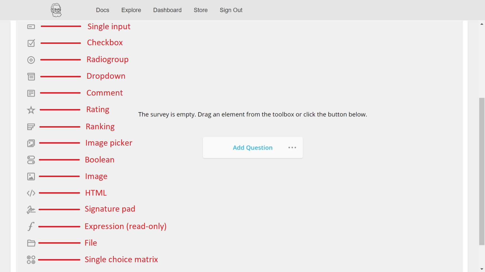

```{r setup, include=FALSE}
knitr::opts_chunk$set(echo = TRUE)
```

# Welcome {#top .tabset}

Pavlovia's survey builder enables you to create surveys similar to those you may have made in Qualtrics.
This page will provide guidance on how to get started with Pavlovia.
If you have any questions, please contact the Psychology Technician at [lcamus@qmu.ac.uk](mailto:lcamus@qmu.ac.uk).

Each tab below covers different aspects of Pavlovia - it is recommended you read all of them in detail for best results.
<!-- If you are creating a survey, the Online Experiments tab can be ignored. -->

Please be aware this is a live document and is subject to change as I expand the guidance.

## Create an account

You will first need to create an account with Pavlovia. To do so, please go to the [Pavlovia sign up page](https://gitlab.pavlovia.org/users/sign_in) and click on the Register tab.

Make sure you follow the steps below so that you are covered by the QMU Pavlovia license, which enables you to collect data for free.

Enter:

* your full name
* a username -- use the first half of your QMU email address (example jsmith1 if you are a member of staff, or your student number if you are a student)
* your QMU email address
* a strong password consisting of upper and lower case letters, numbers and special symbols -- make sure this is secure as your studies and data will be accessible through this account.

Please note that unlike Qualtrics, I do not have control over your login credentials, and will not be able to help with issues regarding forgotten login credentials.
Should you forget your password, the Sign in page has a "Forgot your password?" link for you to set a new password.

## Surveys

#### Contents
[Create your survey](#survey1)  
[Design your survey](#survey2)  
[Adding collaborators to your survey](#survey3)  

### Create your survey {#survey1}
Once you are signed into Pavlovia, you will land on your Dashboard, where you can see all your account's details.
For the purposes of creating a survey, we are only interested in the Surveys tab (see picture below, in the red box). Click on the Surveys tab to start.

``` {r, fig.cap = "Step 1", fig.alt = "Step 1 picture: A screenshot of the Pavlovia dashboard, it shows the user's profile. The screenshot is edited to highlight the Surveys tab that needs to be clicked to proceed.", label = "2.1", echo = F}
knitr::include_graphics("2.1.png")
```

Once in the Surveys tab, you will see options to create or import surveys. 
Currently the import option is still rudimentary, so we will create surveys from scratch.
Click on the New Survey button as shown in the picture below.

``` {r, fig.cap = "Step 2", fig.alt = "Step 2 picture: A screenshot of the Pavlovia Surveys options. The screenshot is edited to highlight the New Survey button that needs to be clicked to proceed.", label = "2.2", echo = F}
knitr::include_graphics("2.2.png")
```

A new survey will appear in the list of surveys (see picture below for example).

``` {r, fig.cap = "Step 3", fig.alt = "Step 3 picture: A screenshot of the Pavlovia Surveys options. The screenshot is edited to highlight the new survey that has appeared on the screen.", label = "2.3", echo = F}
knitr::include_graphics("2.3.png")
```

Before proceeding to the design of the survey, you will need to rename it to something more descriptive/clearer, as shown in box 1 in the picture below. 
To do so, click on the survey's current name, delete the existing text, and rename your survey.

Once this is done, click the "Open" button to open the survey in a new page to start designing it (red box 2 below).

``` {r, fig.cap = "Steps 4 and 5", fig.alt = "Steps 4 and 5 picture: A screenshot of the Pavlovia Surveys options. The screenshot is edited to highlight the name of the survey needing changed, and the 'Open' button that needs to be clicked to proceed.", label = "2.4", echo = F}
knitr::include_graphics("2.4.png")
```

### Design your survey {#survey2}

[Question types](#qtypes)  
[Survey structure](#struct)  
[Logic](#logic)  
[Randomisation](#random)  
[Survey preview](#preview)  

Once you open your new survey, you will be directed to the survey designer as pictured below.

``` {r, fig.cap = "Survey designer", fig.alt = "Survey designer picture: A screenshot of the Pavlovia Survey designer. The screenshot is edited to highlight...", label = "3.1", echo = F}
knitr::include_graphics("3.1.jpeg")
```

The Designer tab provides you with an interface to allow you to click or drag options for your survey.
The main window (displaying the message "The survey is empty. Drag an element from the toolbox or click the button below." in the picture above) is where survey questions are displayed and edited.
On the left is the "toolbox" column, with different question options that you can drag into the main window.

The Preview tab is where you can preview your survey as you design it (see [here](#preview) for more details).

The Logic tab is for setting up survey logics, which we cover in more detail [below](#logic).

The JSON Editor is for advanced editing using the survey's source code (not covered in this documentation).

All the way to the right are also the Survey options button (highlighted in the picture), with Undo and Redo arrows to the left of it.

#### Question types {#qtypes}

There are many question types in Pavlovia surveys, which you can find in the toolbox on the left of the survey designer.
These question types are very similar to those found in Qualtrics if you have experience with this platform, although they do not always share the same names.

The picture below shows what question type each icon represents.

``` {r, fig.cap = "Question types", fig.alt = "Question types picture: A screenshot of the Pavlovia Survey designer, and specifically the sidebar on the left with the different question types that can be added to the survey. The screenshot is edited to highlight...", label = "3.2", echo = F}

```

The question types available are described below, however I recommend playing around with different types to see what suits your needs best.

* Single input: Allows for a one-line text entry.
* Checkbox: Multiple-choice question where multiple answers are allowed.
* Radiogroup: Multiple-choice question where only one answer is allowed.
* Dropdown: Question with a dropdown answer.
* Comment: Allows for a multi-line text entry.
* Rating: Single-question, Likert-type scale answer.
* Ranking: Allows respondent to rank different answers.
* Image picker: Respondents choose an image or video out of many.
* Boolean: Dichotomous answer (e.g. Yes/No) - does not allow for more options.
* Image: Displays an image, video or Youtube video (via link).
* HTML: Allows user to create and display HTML content. Typically used to display information and debrief documents or other standalone text.
* Signature pad: Allows respondents to sign.
* Expression (read-only): 
* File: Allows respondents to upload a file.
* Single-choice matrix: Creates a matrix of questions and answers - typically used for questionnaires with multiple questions and Likert-type scale answers. Only allows one answer per row.
* More: The more button (three dots ...) contains additional question types
  + Multiple-choice matrix: Same as single-choice matrix but allows multiple answers per row.
  + Dynamic matrix:
  + Multiple text:
  + Panel:
  + Dynamic panel:
  
To add a new question, click on "Add question" or on any of the question icons in the toolbox.
You can also drag the question icon anywhere on the survey to place a new question where you need in the survey.

Each question has the same structure and options (see picture below):

* The button to move the question around - to move the question to different parts of the survey, just click and hold that button and drag the question to the desired area (box 1).
* The question field, where the question to participants is inserted (box 2).
* The question's content, which will vary based on the question type (box 3). In this case, a radiogroup-type question has been selected and so we see fields for the multiple answers you can create.
* The question type button - this both informs you of the question's type, but also allow you to change it to another type. Just click the button and select a different type from the drop-down menu (box 4).
* The question options (box 5) - these 4 buttons allow you to change the question's settings:
  + Duplicate - this allows you to make an exact copy of the question, which will be created below the copied question.
  + Settings - this button opens the settings menu for this question. This is where you will find options to change the name of the question, the questions content (in more detail than what is possible in the main window), the question's logic (details [below](#logic)), settings relating to the question's data, and finally the question's validation.
  + Required - this button makes the question unskippable, as an answer is required from participants to continue with the survey.
  + Delete - deletes the question.

``` {r, fig.cap = "Question structure", fig.alt = "Question structure picture: A screenshot of the Pavlovia Survey designer, and specifically of a newly added question. The screenshot is edited to highlight the different question options explained above.", label = "3.3", echo = F}
knitr::include_graphics("3.3.jpeg")
```

#### Survey structure {#struct}

Pavlovia surveys have a specific structure to enable options such as survey logics and branching.

A survey is composed of questions contained in different pages.
If you have used Qualtrics in the past, Pavlovia pages are similar to Qualtrics blocks.

Once you add your first question in your survey, new design and structure options will appear (see picture below).

``` {r video, echo=F}
#https://rdrr.io/github/mccarthy-m-g/embedr/man/embed_video.html#:~:text=embed_video%20%28%29%20provides%20a%20standard%20way%20to%20embed,text%20when%20the%20output%20format%20is%20not%20HTML.
```

You can now add a survey title and a description.
These will be seen by the participant and should therefore be clear and informative.

You will also see you now have a Page 1 and a Page 2, which can be renamed.
These names will not be visible to participants and are instead there for your own benefit.

To create a new page, click on the Survey options button, find the Pages option, then click Add New.
See the recording below for a demonstration.

``` {r video2, echo=F}
#https://rdrr.io/github/mccarthy-m-g/embedr/man/embed_video.html#:~:text=embed_video%20%28%29%20provides%20a%20standard%20way%20to%20embed,text%20when%20the%20output%20format%20is%20not%20HTML.
```

Questions within the same page will be displayed to participants at the same time, unless some questions are part of a logic (detailed [here](#logic)).

<!-- The basic recommended structure is to place the participant information and consent forms on one page, demographics (if collected) on a separate page,  -->

#### Logic {#logic}
Logic can be applied in your survey to control what questions participants see based on their previous answers.
It is also most commonly used to enable informed consent by making sure only those who consent are shown the rest of your survey.

Below is an example where seeing the second question is dependent on a participant's answer to the first question.
There is a demonstration video after the instructions.

Say you want to make sure that participants who report liking fruit (Q1) are shown a second question asking them what their favourite fruit is (Q2) - you want to apply a logic on Q2 to only show if the Q1 answer is "I like fruit".

To do this, create both questions first.
Then in Q2, click the Settings button and find the Logic option in the new panel on the right.
In the "Visible if" section, click the magic wand button - this will bring up a new window for you to set your logic parameters.

Click the "Select" button to set which question this logic is dependent on (in this example it's Q1).
Click the "Equals" button if you need to change what state needs to be met for the logic to work.
In this example, we want a specific Q1 answer so Equals is fine.

You will now be able to set what answer participants need to select to move on to the second question.
Under the Q1 question ("Do you like fruit?" here), click the "Select..." button and choose the answer you need ("I like fruit" here).

Think of it as saying that if the Q1 answer = "I like fruit" then Q2 will be visible to participants, otherwise it will be skipped.

Once you are happy with your settings, click the green "Apply" button and exit the question options by clicking outside of the panel.

``` {r logic1, echo=F}
#https://rdrr.io/github/mccarthy-m-g/embedr/man/embed_video.html#:~:text=embed_video%20%28%29%20provides%20a%20standard%20way%20to%20embed,text%20when%20the%20output%20format%20is%20not%20HTML.
```


``` {r logic2, echo=F}
#https://rdrr.io/github/mccarthy-m-g/embedr/man/embed_video.html#:~:text=embed_video%20%28%29%20provides%20a%20standard%20way%20to%20embed,text%20when%20the%20output%20format%20is%20not%20HTML.
```

#### Randomisation {#random}

#### Survey preview {#preview}
You can see what your survey looks like as you are designing it by clicking on the Preview tab (next to the Designer tab, see picture below).

``` {r, fig.cap = "Survey Preview tab", fig.alt = "Survey Preview tab picture: A screenshot of the Pavlovia Survey Preview. The screenshot is edited to highlight where the Preview tab is situated.", label = "3.8", echo = F}
# knitr::include_graphics("3.3.jpeg")
```

There, you will be able to go through your survey to see how it will be presented to participants.
You will also be able to test logics you have put in place.

This is different to piloting your survey, which you can also do to ensure your survey is working the way you want it (this will not enable participants to see the survey, but rather will allow you to test it yourself).
More details on your survey's status (including the Piloting status) can be found in the "Run your study" tab, under "Survey status".

### Adding collaborators to your survey {#survey3}
If you are running a study with colleagues, or if you are a student whose supervisor needs access to your survey, then you will need to share your survey with them.

In the Surveys tab on the [Pavlovia dashboard](https://pavlovia.org/dashboard?tab=4), you will be able to see all your Pavlovia surveys.

First, tick the box for the survey you wish to modify (see Figure \ref{fig:4.1}, tick the box circled in red).

``` {r, fig.cap = "Step 1", fig.alt = "Step 1 picture: A screenshot of the Surveys tab on the Pavlovia dashboard, it shows a list of the user's surveys. The screenshot is edited to highlight the steps needed to proceed.", label = "4.1", echo = F}
knitr::include_graphics("4.1.png")
```

This will bring up new options, including the option to "Share selected surveys" - click this option (see Figure \ref{fig:4.2}, click the option in the red box).

``` {r, fig.cap = "Step 2", fig.alt = "Step 2 picture: The same screenshot, this time it highlights the 'Share selected surveys' button that needs to be clicked to move onto the next step.", label = "4.2", echo = F}
knitr::include_graphics("4.2.png")
```

This will open a new window with options to share your survey (see Figure \ref{fig:4.3}. 
You can give collaborators either Read or Write access. 
The instructions below are to give Write access, which is most likely if you are sharing the survey with people who need to make changes to the survey too.

If you want those you share the survey with to only be able to see the survey but not make changes, follow the same steps but with the "Read Access" option.

``` {r, fig.cap = "Step 3", fig.alt = "Step 3 picture: A screenshot of the new window opened, with the Read and Write Access options shown.", label = "4.3", echo = F}
knitr::include_graphics("4.3.png")
```

Scroll down to the bottom of the window. 
In the "Write Access" box, scroll down to see who currently has write access (if you haven't gone through this process before, only you will have access).

You can then write the username of the colleague or supervisor you wish to give access to, next to your own (see Figure \ref{fig:4.4}, write the username in the red box area). 
Once you have added all the collaborators you wish to add, click on the "Share surveys" button at the bottom of the window (the second red box in the picture) to complete the process.

``` {r, fig.cap = "Step 4", fig.alt = "Step 4 picture: The same screenshot, this time showing where the user needs to complete the steps explained.", label = "4.4", echo = F}
knitr::include_graphics("4.4.png")
```

[Back to top](#top)

<!-- ## Online experiments -->
<!-- TBC -->

## Run your study

### Approval documents

### Survey status {#status}

### Survey link


[Back to top](#top)

## Link Pavlovia to Sona