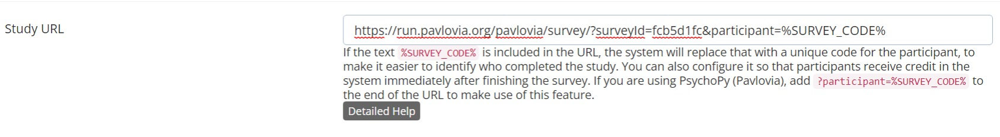

```{r setup, include=FALSE}
knitr::opts_chunk$set(echo = TRUE)
```

Welcome to the guidance documentation for using Pavlovia to create and run surveys online.

There is a table of contents on the left to help you navigate this guide and its main sections.
Clicking on a section in the table will take you to the section and display subheadings within this section.

Please be aware this is a live document and is subject to change as I expand the guidance.

# Create an account {#account}

If you wish to use Pavlovia to create a survey or put an experiment online, please contact me at [lcamus@qmu.ac.uk](mailto:lcamus@qmu.ac.uk) if you haven't already to get set up.

I will create an account for you and send you the link for [resetting your password](https://gitlab.pavlovia.org/users/password/new).
You will then be able to login and get started.

<!-- You will first need to create an account with Pavlovia. To do so, please go to the [Pavlovia sign up page](https://gitlab.pavlovia.org/users/sign_in) and click on the Register tab. -->

<!-- Make sure you follow the steps below so that you are covered by the QMU Pavlovia license, which enables you to collect data for free. -->

<!-- Enter: -->

<!-- * your full name -->
<!-- * a username -- use the first half of your QMU email address (example jsmith1 if you are a member of staff, or your student number if you are a student) -->
<!-- * your QMU email address -->
<!-- * a strong password consisting of upper and lower case letters, numbers and special symbols -- make sure this is secure as your studies and data will be accessible through this account. -->

Please note that unlike Qualtrics, I do not have control over your login credentials, and will not be able to help with issues regarding forgotten login credentials.
Should you forget your password, the Sign in page has a "Forgot your password?" link for you to set a new password.

When you first log in, there is a chance you will land on the GitLab end of Pavlovia, which is not where you will be able to create and manage your surveys and online experiments.
Check the website link, if it starts with https://gitlab.pavlovia.org/ you are not in the right place.
Instead, make sure you go to https://pavlovia.org/dashboard.

# Pavlovia surveys {#surveys}

Pavlovia's survey builder enables you to create surveys similar to those you may have made in Qualtrics.
This page will provide guidance on how to get started with Pavlovia.
If you have any questions, please contact me at [lcamus@qmu.ac.uk](mailto:lcamus@qmu.ac.uk).

Each section below covers different aspects of Pavlovia surveys - it is recommended you read all of them in detail for best results.
<!-- If you are creating a survey, the Online Experiments tab can be ignored. -->

## Survey creation {#survey1}
Once you are signed into Pavlovia, you will land on your Dashboard, where you can see all your account's details.
For the purposes of creating a survey, we are only interested in the Surveys tab (see picture below, in the red box). Click on the Surveys tab to start.

``` {r, fig.cap = "Step 1", fig.alt = "Step 1 picture: A screenshot of the Pavlovia dashboard, it shows the user's profile. The screenshot is edited to highlight the Surveys tab that needs to be clicked to proceed.", label = "2.1", echo = F}
knitr::include_graphics("2.1.png")
```

Once in the Surveys tab, you will see options to create or import surveys. 
Currently the import option is still rudimentary, so we will create surveys from scratch.
Click on the New Survey button as shown in the picture below.

``` {r, fig.cap = "Step 2", fig.alt = "Step 2 picture: A screenshot of the Pavlovia Surveys options. The screenshot is edited to highlight the New Survey button that needs to be clicked to proceed.", label = "2.2", echo = F}
knitr::include_graphics("2.2.png")
```

A new survey will appear in the list of surveys (see picture below for example).

``` {r, fig.cap = "Step 3", fig.alt = "Step 3 picture: A screenshot of the Pavlovia Surveys options. The screenshot is edited to highlight the new survey that has appeared on the screen.", label = "2.3", echo = F}
knitr::include_graphics("2.3.png")
```

Before proceeding to the design of the survey, you will need to rename it to something more descriptive/clearer, as shown in box 1 in the picture below. 
To do so, click on the survey's current name, delete the existing text, and rename your survey.

Once this is done, click the "Open" button to open the survey in a new window to start designing it (box 2 below).

``` {r, fig.cap = "Steps 4 and 5", fig.alt = "Steps 4 and 5 picture: A screenshot of the Pavlovia Surveys options. The screenshot is edited to highlight the name of the survey needing changed, and the 'Open' button that needs to be clicked to proceed.", label = "2.4", echo = F}
knitr::include_graphics("2.4.png")
```

## Survey design {#survey2}

Once you open your new survey, you will be directed to the survey designer as pictured below.

``` {r, fig.cap = "Survey designer", fig.alt = "Survey designer picture: A screenshot of the Pavlovia Survey designer. The screenshot is edited to highlight the question toolbox on the left, the main designer window in the middle, and the survey settings button on the right.", label = "3.1", echo = F}
knitr::include_graphics("3.1.jpeg")
```

The Designer tab provides you with an interface to allow you to click or drag options for your survey.
The main window (displaying the message "The survey is empty. Drag an element from the toolbox or click the button below." in the picture above) is where survey questions are displayed and edited.
On the left is the "toolbox" column, with different question options that you can drag into the main window.

The Preview tab is where you can preview your survey as you design it (see [here](#preview) for more details).

The Logic tab can be used to set up and see survey logics, which I cover in more detail [below](#logic).

The JSON Editor tab is for advanced editing using the survey's source code (not covered in this documentation).

All the way to the right is also the Survey settings button (highlighted in the picture), with Undo and Redo arrows to the left of it.

Above that are the survey management buttons:

* Save: click this to save your survey - make sure you do so regularly.
* Download: click this to download your survey, which allows you to import it into Pavlovia and use it in online PsychoPy experiments.
* Clear: click this to delete everything in your survey - this is will erase everything **permanently**.

If you have a wide display (your screen is bigger), you may see a slightly different interface, as the settings panel is open by default on the right (see picture below).
As you edit your survey and click on different components of your survey (pages, questions, etc.), the settings panel will update to display the settings for the corresponding component.

``` {r, fig.cap = "Survey designer (wide display version)", fig.alt = "Survey designer picture: A screenshot of the Pavlovia Survey designer as seen on wider displays. The screenshot is edited to highlight the difference between the smaller and wider displays.", label = "3.1b", echo = F}

```

### Question types {#qtypes}

There are many question types in Pavlovia surveys, which you can find in the toolbox on the left of the survey designer.
These question types are very similar to those found in Qualtrics if you have experience with this platform, although they do not share the same names.

The picture below shows what question type each icon represents.

``` {r, fig.cap = "Question types", fig.alt = "Question types picture: A screenshot of the Pavlovia Survey designer, and specifically the sidebar on the left with the different question types that can be added to the survey. The screenshot is edited to highlight the different question types and their names", label = "3.2", echo = F}
knitr::include_graphics("3.2.jpeg")
```

The question types available are described below, however I recommend playing around with different types to see what suits your needs best.

* Single input: Allows for a one-line text entry.
* Checkbox: Multiple-choice question where multiple answers are allowed.
* Radiogroup: Multiple-choice question where only one answer is allowed.
* drop-down: Multiple-choice question where one answer can be selected from a drop-down menu.
* Comment: Allows for a multi-line text entry.
* Rating: Single-question, Likert-type scale answer.
* Ranking: Allows respondent to rank different answers.
* Image picker: Respondents choose an image or video out of many.
* Boolean: Dichotomous answer (e.g. Yes/No) - does not allow for more options.
* Image: Displays an image, video or Youtube video (via link) - there is no question.
* HTML: Allows user to create and display text. Typically used to display information and debrief documents or other standalone text (not questions/answers).
* Signature pad: Allows respondents to draw their response.
* Expression (read-only): Used to calculate a value for later use in the survey - there is no question.
* File: Allows respondents to upload a file.
* Single-choice matrix: Creates a matrix of multiple-choice questions with the same set of answers - typically used for questionnaires with multiple questions and Likert-type scale answers. Only allows one answer per row.
* More: The more button (three dots ...) contains additional question types
  + Multiple-choice matrix: Same as single-choice matrix but allows multiple answers per row.
  + Dynamic matrix: Used to get a Multiple-Choice Matrix without a column of items.
  + Multiple text: Creates a form made up of several Single Input questions
  + Panel: Creates a form made up of multiple questions of any type.
  + Dynamic panel: Creates a form made up of multiple questions of any type, which can be expanded by the participant.
  
To add a new question, click on "Add question" or on any of the question icons in the toolbox.
You can also drag the question icon anywhere on the survey to place a new question where you need in the survey.

Each question has the same structure and options (see picture below):

* The button to move the question around - to move the question to different parts of the survey, just click and hold that button and drag the question to the desired area (box 1).
* The question field, where the question to participants is inserted (box 2).
* The question's content, which will vary based on the question type (box 3). In this case, a radiogroup-type question has been selected and so we see fields for the multiple answers you can create.
* The question type button - this both informs you of the question's type, and allows you to change it to another type. Just click the button and select a different type from the drop-down menu (box 4).
* The question options (box 5) - these 4 buttons allow you to change the question's settings:
  + Duplicate - this allows you to make an exact copy of the question, which will be created below the copied question.
  + Settings - this button opens the settings menu for this question. This is where you will find options to change the name of the question, the questions content (in more detail than what is possible in the main window), the question's logic (details [below](#logic)), settings relating to the question's data, and finally the question's validation.
  + Required - this button makes the question unskippable, as an answer is required from participants to continue with the survey.
  + Delete - deletes the question.

``` {r, fig.cap = "Question structure", fig.alt = "Question structure picture: A screenshot of the Pavlovia Survey designer, and specifically of a newly added question. The screenshot is edited to highlight the different question options explained above.", label = "3.3", echo = F}
knitr::include_graphics("3.3.jpeg")
```

As highlighted at the start of this section, the interface for questions will look slightly different if you have a wider display.
The settings panel will be open automatically on the right side of the interface, and the settings button present on the question on smaller displays will not be there.
The question toolbox will also display more questions and their names as there is more space on the screen.

``` {r, fig.cap = "Question structure (wide display version)", fig.alt = "Question structure picture: A screenshot of the Pavlovia Survey designer, and specifically of a newly added question, as seen on a wider display. The screenshot is edited to highlight the difference between the smaller and wider display.", label = "3.3b", echo = F}

```

### Survey structure {#struct}

Pavlovia surveys have a specific structure to enable options such as survey logics and branching.

A survey is composed of questions contained in different pages.
If you have used Qualtrics in the past, Pavlovia pages are similar to Qualtrics blocks.

Once you add your first question in your survey, new design and structure options will appear (see picture below).

``` {r, fig.cap = "Survey structure", fig.alt = "Survey structure picture: A screenshot of the Pavlovia Survey designer, and specifically of the survey structure. The screenshot is edited to highlight the different survey options.", label = "3.4", echo = F}
knitr::include_graphics("3.4.jpeg")
```

You can now add a survey title and a description (box 1).
These will be seen by the participant and should therefore be clear and informative.

You will also see you now have a Page 1 and a Page 2, which can be renamed (box 2).
These names will also be visible to participants.

If you click on a page (rather than on a question), you will also see buttons for page options (box 3).
These options are similar to question options:

* Duplicate: Creates a copy of the current page below.
* Settings : Accesses the page settings panel on the right.
* Delete: Deletes the page.

As with questions, the interface looks slightly different on wider displays.
The settings button for pages is not available, and instead the settings panel is automatically open on the right of the interface.

``` {r, fig.cap = "Survey structure (wider display version)", fig.alt = "Survey structure picture: A screenshot of the Pavlovia Survey designer, and specifically of the survey structure, as seen on wider displays. The screenshot is edited to highlight the difference between smaller and wider displays.", label = "3.4b", echo = F}

```

To create a new page, click on the Survey settings button, find the Pages tab, then click the + button to add a new page.
See the recording below for a demonstration.

``` {r survey1, echo=F}
#remotes::install_github("mccarthy-m-g/embedr")
embedr::embed_video("survey1.mp4", "mp4")
```

<br> Questions within the same page will be displayed to participants at the same time, unless some questions are part of a logic (detailed [here](#logic)).

<!-- The basic recommended structure is to place the participant information and consent forms on one page, demographics (if collected) on a separate page,  -->

### Logic {#logic}
Logic can be applied in your survey to control what questions participants see based on their previous answers.
It is also most commonly used to enable informed consent by making sure only those who consent are shown the rest of your survey.

Below is an example where seeing the second question is dependent on a participant's answer to the first question.
There is a demonstration video after the instructions.

Say you want to make sure that participants who report liking fruit (question 1, named fruits1) are shown a second question asking them what their favourite fruit is (question 2, named fruits2) - you want to apply a logic so that fruits2 only shows if the fruits1 answer is "Yes".

To do this, create both questions first.
Then in fruits2, click the Settings button and find the Logic tab in the new panel on the right.
In the "Visible if" section, click the magic wand button - this will bring up a new window for you to set your logic parameters.

Click the "Select" button to set which question this logic is dependent on (in this example it's fruits1).
Click the "Equals" button if you need to change what state needs to be met for the logic to work.
In this example, we want a specific fruits1 answer so Equals is fine.

You will now be able to set what answer participants need to select to move on to the second question.
Under the fruits1 question ("Do you like fruits?" here), click the "Select..." button and choose the answer you need ("Yes" here).

Think of it as saying that if the fruits1 answer = "Yes" then fruits2 will be visible to participants, otherwise it will be skipped.

Once you are happy with your settings, click the green "Apply" button and exit the question settings by clicking outside of the panel.

``` {r logic1, echo=F}
embedr::embed_video("logic1.mp4", "mp4")
```

<br> Survey logic can also be more complex, for example if the display of a question is dependent on multiple answer possibilities in previous questions.

In the previous example, if we had a third question (named fruits3) asking participants to tell us about their favourite fruit, and we wanted this question to be visible if participants had picked any of the fruits in fruits2, we would have to add conditions to our logic for fruits3.

There is a video after the instructions to demonstrate this process.

First, follow all the previous steps to get the fruits3 logic settings.

Once there, instead of selecting one answer and ending the logic there, we will add multiple conditions.
The first condition is created the same as above.

Click the "Select" button to set which question this logic is dependent on (here it's fruits2).
Click the "Equals" button if you need to change what state needs to be met for the logic to work.
In this example, we want a specific fruits2 answer so Equals is fine.

You can now select what answer participants need to choose to move on to the third question.
Under the fruits2 question ("What are your favourite fruits?" here), click the "Select..." button and choose the answer you need (I have selected the first one, "Apples").

Now, rather than clicking Apply and finishing there, we will add new conditions, one for each possible answer.

Click the "Add Condition" button below what you have just created.
This will display a new condition for you to set up, similarly to the first one you did.
However, you will see there is a new "and" button.

The "and" button allows you to control how the conditions work together when applying the logic to your question.
For example, if you select "and", condition 1 **and** condition 2 need to be met for the logic to be applied.
In this example, that means participants need to have responded "Apples" **and** "Bananas" (for example) in the second question (fruits2) for the third question (fruits3) to be shown to them.

If you click the "and" button, you will see a second option, "or".
When selected, the "or" option means that condition 1 **or** condition 2 need to be met for the logic to be applied.
In this example, that means participants need to have responded "Apples" **or** "Bananas" (for example) in the second question for the third question to be shown to them.

In our case, we want participants to be shown fruits3 if they have responded to fruits2 with "Apples", **or** "Bananas", **or** "Strawberries", **or** "Raspberries."
So in this case, we will create 3 more conditions and select "or" for each one.

``` {r logic2, echo=F}
embedr::embed_video("logic2.mp4", "mp4")
```

<br> In this case, we can also change the "Equals" button to "Any of", as we want to show fruits3 if participants have chosen any of the answers in fruits2.
This is faster than picking each question separately as above, but does not work in all cases.
The video below demonstrates how to do this.

``` {r logic3, echo=F}
embedr::embed_video("logic3.mp4", "mp4")
```

<br> In both these examples, we have kept the "Equals" button as is.
However, there are multiple options which can be used for different scenarios.

Clicking on the "Equals" button will show you other options you can select (these depend on the question you have selected, not all will show):

* Empty: select this if you want your question to be visible if the participant has not responded to the previous question the logic is dependent on (e.g. if the participant did not respond to question 1, show question 2).
* Not empty: the opposite of Empty. Select this if you want your question to be visible if the participant has responded to the previous question the logic is dependent on (e.g. if the participant responded to question 1, show question 2).
* Equals: select this if you want your question to be visible if the participant has chosen a specific answer to the previous question the logic is dependent on (e.g. if the participant's answer to question 1 = answer A, show question 2).
* Does not equal: The opposite of Equals. Select this if you want your question to be visible if the participant has not chosen a specific answer to the previous question the logic is dependent on (e.g. if the participant's answer to question 1 =/= answer A, show question 2).
* Any of: select this if you want your question to be visible if the participant has chosen any of the answers to the previous question the logic is dependent on (e.g. if the participant's answer to question 1 is either answer A, answer B, or answer C, show question 2).
* All of: select this if you want your question to be visible if the participant has chosen all of the answers to the previous question the logic is dependent on (e.g. if the participant's answer to question 1 is answer A, answer B, and answer C, show question 2).
* Contains: select this if you want your question to be visible if the participant has chosen an answer that contains specific input (such as words or numbers) to the previous question the logic is dependent on (e.g. if the participant's answer to question 1 is a specific word, show question 2).
* Does not contain: select this if you want your question to be visible if the participant has not chosen an answer that contains specific input (such as words or numbers) to the previous question the logic is dependent on (e.g. if the participant's answer to question 1 is not a specific word, show question 2).
* Greater than: select this if you want your question to be visible if the participant has chosen an answer greater than a set point to the previous question the logic is dependent on. This is used for questions with scaled answers, such as Likert-type scales or ratings (e.g. if the participant's answer to question 1 is greater than 2 on a scale of 1-5, show question 2).
* Lesser than: select this if you want your question to be visible if the participant has chosen an answer lesser than a set point to the previous question the logic is dependent on. This is used for questions with scaled answers, such as Likert-type scales or ratings (e.g. if the participant's answer to question 1 is lesser than 3 on a scale of 1-5, show question 2).
* Greater than or equal to: same as Greater than, except an answer equal to the set point also leads to the second question being visible (e.g. if the participant's answer to question 1 is greater than or equal to 2 on a scale of 1-5, show question 2)
* Lesser than or equal to: same as Lesser than, except an answer equal to the set point also leads to the second question being visible (e.g. if the participant's answer to question 1 is lesser than or equal to 3 on a scale of 1-5, show question 2).

### Randomisation {#random}

There are multiple randomisation options within a Pavlovia survey.
You can randomise questions within a page, or randomise items within certain question types.
You can also randomise pages using the new flow view.

#### **Randomise question within a page**

If you want to randomise questions within a page, open the page's settings, navigate to the Layout tab in the settings panel, and select the "Random" box under "Element order on the page" (see picture below).

Please be aware that currently, if you randomise questions within a page and also have logics in place on some of these questions, if logics are met the newly visible question will appear randomly on the page (including potentially before the question the logic was dependent on).
For example, if you have 4 questions on a page with randomisation, and question 4 is dependent on question 3, if question 4 is shown it may be shown anywhere on the page, including before question 3.

``` {r, fig.cap = "Randomisation within pages", fig.alt = "Randomisation within pages picture: A screenshot of the Pavlovia Survey designer, and specifically of where to find the option to randomise questions within a page.", label = "3.5", echo = F}

```

#### **Randomise items within certain questions**

If you want to randomise items within Checkbox, Radiogroup, Ranking or Image Picker question types, open the question's settings, navigate to the Choices tab in the settings panel, and select "Random" in the drop-down menu under "Choices sort order" (see picture below).

``` {r, fig.cap = "Randomisation within Checkbox, Radiogroup, Ranking or Image Picker questions", fig.alt = "Randomisation within Checkbox, Radiogroup, Ranking or Image Picker questions: A screenshot of the Pavlovia Survey designer, and specifically of where to find the option to randomise items within Checkbox, Radiogroup, Ranking or Image Picker questions.", label = "3.6", echo = F}

```

If you want to randomise items within a Single-Choice Matrix question, open the question's settings, navigate to the Rows tab in the settings panel, and select the "Random" box under "Row order" (see picture below).

``` {r, fig.cap = "Randomisation within Single-Choice Matrix questions", fig.alt = "Randomisation within Single-Choice Matrix questions: A screenshot of the Pavlovia Survey designer, and specifically of where to find the option to randomise items within Single-Choice Matrix questions.", label = "3.7", echo = F}

```

#### **Randomise pages (or blocks)**

If you have multiple pages/different sets of questions, and you wish for these to be displayed to participants in a random order, you can make use of the new flow view options in Pavlovia surveys.

In Pavlovia, you will see the flow view greyed-out when you first access the Designer tab in your survey, which you can toggle by clicking on the button pictured in the red box below (the button looks like a small grid made of 3x3 black squares).

``` {r, fig.cap = "Greyed-out flow view in Designer tab", fig.alt = "Greyed-out flow view in Designer tab: A screenshot of the Pavlovia Survey designer, and specifically of where to find the new flow view.", label = "flow-view1", echo = F}

```

Once you've toggled the flow view, you will see the flow of your survey and different components you can use.
There are 3 components you can use to edit the flow of your survey (see box 1 of the screenshot below):

* the ```block``` component acts like a survey - each block will have one or more pages and questions. When you create a ```block```, it will look like a standalone survey
* the ```sequence``` component allows you to display a group of blocks sequentially (one after the other, in the order you put them)
* the ```shuffle``` component allows you to display a group of blocks randomly (the component will shuffle the blocks and show them in a random order)

With this feature, you can create separate blocks, each with their own pages and questions.
You can then insert these blocks in either a sequence or a shuffle component, which will determine the order in which the blocks are shown (see box 2 of the screenshot below).

``` {r, fig.cap = "Flow view components", fig.alt = "Flow view components: A screenshot of the Pavlovia Survey designer, and specifically of flow view components.", label = "flow-view2", echo = F}

```

An example use of this feature is if you have different questionnaires and you wish to show these in a random order to your participants.
Each questionnaire would be in a different block, and these blocks would then be inserted in a shuffle component which would display the blocks in a random order.

However, **be aware that currently there isn't a way to ensure an even distribution of participants across different display orders**.
For example, if you have two questionnaires, you cannot specify that each questionnaire should be seen first by an equal number of participants (e.g. 20 participants see questionnaire 1 first, and 20 see questionnaire 2 first).
If you wish to do this you will need to integrate your surveys with an online PsychoPy experiment.

I will follow the example above to demonstrate how to set up a shuffling survey below (you can find the [video demonstration](#shuffle1) after the instructions).

In a new survey, create your first questionnaire as you normally would.
When this is done, toggle the flow view.
You will see that you already have an orange box, most likely named after your survey name, which is the overall ```sequence``` component in which the whole survey will be contained.
Inside, there is one ```block``` - this is your first questionnaire which you have already created.

Now drag and drop a ```shuffle``` component into the orange box, then drag your existing ```block``` inside it.
Drag a second ```block``` inside the blue box, click on it, then click Add question to start creating your second questionnaire.

You now have two ```blocks``` in your ```shuffle``` component - if you try to preview your survey a few times, you should see that the first questionnaire to display is random.

You can continue to do this for as many questionnaires as you have, adding a block per questionnaire into the shuffle component.

Once you're done, add one last block outside the shuffle component but inside the orange sequence component, and make this your debriefing page.

``` {r shuffle1, echo=F}
embedr::embed_video("shuffle1.mp4", "mp4")
```

<br> Please remember that you will still need to set up informed consent and redirection (if the participant does not consent) at the start of your survey for all participants.
Currently there isn't a way to set this up in the same survey, so you will need to create an information and consent survey, which redirects to the shuffling survey if the participant consents, or ends if they don't.

To do this, follow the instructions under [Getting informed consent](#consent), and specifically the section on [skipping without completing](#sona-skip).
You can then add the link to your shuffling survey in the Overview tab, under the Settings section, in the Completion Url box.

### Survey preview {#preview}
You can see what your survey looks like as you are designing it by clicking on the Preview tab (next to the Designer tab, see picture below).

``` {r, fig.cap = "Survey Preview tab", fig.alt = "Survey Preview tab picture: A screenshot of the Pavlovia Survey Preview. The screenshot is edited to highlight where the Preview tab is situated.", label = "3.8", echo = F}
knitr::include_graphics("3.8.jpeg")
```

There, you will be able to go through your survey to see how it will be presented to participants.
You will also be able to test logics you have put in place.

This is different to piloting your survey, which you can also do to ensure your survey is working the way you want it (this will not enable participants to see the survey, but rather will allow you to test it yourself).
More details on your survey's status (including the Piloting status) can be found [here](#status).

## Getting informed consent {#consent}

Any surveys you are creating to collect data for a study will need the first page to be an information sheet and consent form for participants to provide informed consent to participate.

Additionally, the survey should automatically end if participants choose not to consent.

Below is a video demonstrating the whole process, and written instructions can be found after the video.

``` {r example1a, echo=F}
embedr::embed_video("example1a.mp4", "mp4")
```

<br> 

#### Creating the information sheet and consent form {#info}
To do this, make the first Page of your survey the information and consent page.
To create an information sheet, you will need an HTML question to create a question with text that does not require an answer.
Add a new question, select the HTML question type in the dropdown menu and name the question.

To create/edit the text of an HTML question, you need to go in that question's settings.
In the General tab of these settings, you will find a box titled "HTML markup" - this is where we will copy our information sheet.

However, any text copied as is in this box will lose formatting, as this question requires HTML formatting to have paragraphs or bold/italicised text for example.
You can learn a little bit of HTML to understand how to format your text for Pavlovia [here](https://www.w3schools.com/html/default.asp), or use a [text to HTML converter](https://wordtohtml.net/) to copy in your information sheet from Word, and get the HTML equivalent.

All you need to do then is copy then paste the HTML text into the "HTML markup" box as described above.
Once you have done so, the HTML question in the survey designer will update with your text.
Please be aware that using a converter is not fool-proof, and you may lose some content (such as hyperlinks) - once you paste the HTML text into Pavlovia, please double check that everything looks as you want it.

If your text does not look the way you want, consult the HTML tutorial linked above to see if any of the formatting needs edited.
If you are still having issues, please contact [me](mailto:lcamus@qmu.ac.uk).

Now that the information sheet is done, you will need to create your consent form below.
The best way to do this is to create another HTML question with all your consent statements, and a second, Radio Button Group question underneath with two options: consent and no consent.
I will walk through how to do this below.

On the same page as your information sheet, create a new question below and select HTML.
Give your question a name, then paste in your consent statements in the HTML markup box of the question's settings.
Below this question, create a new question and select Radio Button Group, then give it a name.

You will only need 2 items for this question so click on the minus button next to item 3 to delete it.
Now you can edit items 1 and 2 to show the consent options "I have read the statements and consent to participate" and "I do not consent to participate" (or similar wording).
Since this question is related to the statements in the question above, it does not necessarily need a title - to hide the title, navigate to the Layout tab of the question's settings.
Find the "Title location" heading, and select "Hidden" in the dropdown menu below it.
Finally, make sure you make this question required so participants cannot skip it.

#### Creating the skip logic

Now that our information sheet and consent form are created, we need to put a skip logic in place so that participants who do not consent are sent to the end of the survey.
Depending on what you want to achieve, there are two ways to do this.
The first option is to redirect participants to a different page, which does not allow them to complete the survey and does not save any data.
This second is to redirect participants to the standard end-of-survey screen, which allows participants to complete the survey and saves the responses they did complete (the consent form).

The first option is better if you do not wish non-consenters to be counted as having participated in your study.
If you are using Sona or Prolific, chances are you don't want people who haven't participated to still get credits or money, so use this option.

The second option is fine if you don't mind your participants completing the survey and you're interested in gathering information on how many people did not consent to participate in your study.
However, it means that if your study is linked with other platforms, like Sona or Prolific, their participation will be counted as complete and they will be compensated accordingly (with credits in Sona or money in Prolific).

The two sections below go over both options - if you are a student using Sona automatic credit granting, use the first option.
Do not use both options, choose the one which fits your needs best.

Whatever logic you use, please make sure that the logic is working before starting data collection (i.e. if participants do not consent to participate, they are redirected to the end of the survey). 

##### **Skip logic - does not complete the survey (use for Sona or Prolific)** {#sona-skip}

Setting up this logic will depend on how you have set up your consent form, but I will demonstrate how to set up the logic based on the example above.
<!-- This is similar to the complex logic example shown [here](#logic). -->
You can find a video demonstration [here](#example1c), after the text explanation.

For this type of logic, rather than setting the conditions at the survey level, we will set conditions at the page level.
You will need to change the logic for every page you have questions on (i.e. every page where participants have to respond after your information and consent page).

For each of these pages, go to the page's settings, find the Logic tab, and click the wand for the "Visible if" box, which will open a new Logic window (similar to those in the [Logic](#logic) section above).

Once there, we will add one condition for this logic, created as follows:
Click the "Select" button to set which question this logic is dependent on.
Select the question with the consent options (mine is called consent2).
You can leave the "Equals" button as is since that is the condition we want.

You can now select which answer will lead to the page being visible to participants.
Here we want the first answer ("I have read the statements and consent to participate.").
We are telling Pavlovia that if a participant selects the first answer then they have consented and they can see this page and its questions.

<!-- Instructions below are for matrix questions (keeping in case needed later): -->
<!-- Click the "Select" button to set which question this logic is dependent on (here it's the consent form question). -->
<!-- Because the consent form question (named consent) is a matrix, Pavlovia allows you to select the different rows of the question (named consent.Row1 to consent.Row4) - we will start with consent.Row1. -->
<!-- Click the "Equals" button if you need to change what state needs to be met for the logic to work. -->
<!-- In this example, we want a specific answer ("Yes"), so Equals is fine. -->

<!-- You can now select what answers will lead to the page being visible to participants. -->
<!-- Under the consent.Row1 question, click the "Select..." button and choose the answer "Yes". -->
<!-- Here we are telling the software that if a participant's answer is "Yes" then they have consented and they can see this page and its questions. -->

<!-- Now, rather than clicking Apply and finishing there, we will add new conditions, one for each possible answer. -->

<!-- Click the "Add Condition" button below what you have just created. -->
<!-- This will display a new condition for you to set up, similarly to the first one you did. -->
<!-- However, you will see there is a new "and" button (this is explained in the [Logic](#logic) section above). -->

<!-- In our case, we want participants to see the page only if they have consented to all of the statements. -->
<!-- So in this case, we will create 3 more conditions and select **"and"** for each one (this is the default, so you shouldn't have to change anything). -->
<!-- It's important you use "and" conditions for this logic, as we want to make sure any non-consenting response stops participants from seeing the page. -->
<!-- "Or" conditions will show participants the page if they consented to any of the statements (which means that if they have only consented to 3 out of 4 statements, they will still be able to complete the survey, which we do not want). -->

Once this is done, you can click Apply and the logic will be set.
Now you have to do the same thing for all the pages you have in your survey.
Luckily, you can copy the logic you just created and paste it in the same place for the different pages.
Once you have clicked Apply, you will see the settings again, and the "Visible if" box should have text in it.
Copy this text, then find the same settings for the other pages, and paste that text in the "Visible if" boxes for each of the pages.

There are two more steps before your survey is properly set up with this type of skip logic.
You now have to create a page that will be shown to participants if they do not consent to participate, and remove the Complete button which allows participants to complete the survey.

Below your last page, you will see an additional, grayed out page with no questions.
Click the Add Question button, then change the question type to HTML.
This question will be the text shown to participants if they don't consent, so input some text that explains why they have been directed there (see [here](#info) for how to add text).
You can format it using HTML or just write a couple of sentences with no formatting.

Now go to this page's settings, find the Logic tab, and click the wand for the "Visible if" box, which will open a new Logic window.
Once again, we will add one condition for this logic.

Click the "Select" button to set which question this logic is dependent on (it's still the consent form question).
Click the "Equals" button as you need to change what state needs to be met for the logic to work.
In this example, we don't want a specific answer ("I do not consent to participate.") and we don't want an empty response either, so we need to choose "Does not equal".

You can now select which answer will lead to the survey ending.
Here we want the first answer ("I have read the statements and consent to participate.").
We are telling Pavlovia that if a participant's answer is not the first choice (so is either the second choice or empty) then they have not consented and we want them to be directed to the end of the survey.

<!-- Instructions below are for matrix questions: -->
<!-- For the first condition, click the "Select" button to set which question this logic is dependent on (it's still the consent form question). -->
<!-- Click the "Equals" button as you need to change what state needs to be met for the logic to work. -->
<!-- In this example, we don't want a specific answer ("No") and we don't want an empty response either, so we need to choose "Does not equal". -->

<!-- You can now select what answers will lead to the survey ending. -->
<!-- Under the consent.Row1 question, click the "Select..." button and choose the answer "Yes". -->
<!-- Here we are telling the software that if a participant's answer is not "Yes" (so is either "No" or empty) then they have not consented and we want them to be directed to the end of the survey. -->

<!-- Now, we need to do the same thing for all the other consent statement. -->
<!-- Click the "Add Condition" button below what you have just created. -->
<!-- In this case, we want participants to be sent to the end of the survey if they have not consented to either of the statements, so we will create 3 more conditions and select **"or"** for each one. -->

<!-- It's important you use "or" conditions for this logic, as we want to make sure any non-consenting response sends participants to the end of the survey. -->

Once you're done, click Apply to exit the window.

Finally, we need to remove the Complete button and force participants to close the browser page to exit (ensuring their responses are not counted as complete).
You should still be in the settings for the page you have just created, so find the Layout tab (under the Logic tab), and select the "Hidden" option under "Navigation buttons visibility".
This will hide the Complete button for that page.

You are done!
Now participants who do not consent to all of the statements in your consent form will:

* not see the pages of the survey that have questions
* see the page with a message saying they haven't consented
* not be able to complete the survey, which will not count as a complete response in Sona or Prolific

Before sending the survey out, make sure this logic works so you're certain non-consenting participants will not see the rest of your survey.

``` {r example1c, echo=F}
embedr::embed_video("example1c.mp4", "mp4")
```

<br>

##### **Skip logic - completes the survey (do not use for Sona or Prolific)**

Putting this logic in place will depend on how you have set up your consent form (I will use the same as before).
<!-- This is similar to the complex logic example shown [here](#logic). -->
You can find a video demonstration [here](#example1b), after the text explanation.

First, open the Survey settings (not the Page or Question settings) by clicking the settings button.
Then find the Logic tab, and click "Add New" in the box titled "Triggers".
This will show new options.

Click on the "Run expression" button and select "Complete survey" in the drop-down menu.
Then click the wand for the "Expression" box below, which will open a new Logic window (similar to those in the [Logic](#logic) section).

Once there, we will add a condition for this logic as follows:

Click the "Select" button to set which question this logic is dependent on.
Select the question with the consent options (mine is called consent2).
Click the "Equals" button as you need to change what state needs to be met for the logic to work.
In this example, we don't want a specific answer ("I do not consent to participate.") and we don't want an empty response either, so we need to choose "Does not equal".

You can now select which answer will lead to the survey ending.
Here we want the first answer ("I have read the statements and consent to participate.").
We are telling Pavlovia that if a participant's answer is not the first choice (so is either the second choice or empty) then they have not consented and we want them to be directed to the end of the survey.

<!-- Click the "Select" button to set which question this logic is dependent on (here it's the consent form question). -->
<!-- Because the consent form question (named consent) is a matrix, Pavlovia allows you to select the different rows of the question (named consent.Row1 to consent.Row4) - we will start with consent.Row1. -->
<!-- Click the "Equals" button as you need to change what state needs to be met for the logic to work. -->
<!-- In this example, we don't want a specific answer (No) and we don't want an empty response either, so we need to choose Does not equal. -->

<!-- You can now select what answers will lead to the survey ending. -->
<!-- Under the consent.Row1 question, click the "Select..." button and choose the answer "Yes". -->
<!-- Here we are telling the software that if a participant's answer is not "Yes" (so is either No or empty) then they have not consented and we want them to be directed to the end of the survey. -->

<!-- Now, rather than clicking Apply and finishing there, we will add new conditions, one for each possible answer. -->

<!-- Click the "Add Condition" button below what you have just created. -->
<!-- This will display a new condition for you to set up, similarly to the first one you did. -->
<!-- However, you will see there is a new "and" button (this is explained in the [Logic](#logic) section above). -->

<!-- In our case, we want participants to be sent to the end of the survey if they have not consented to either of the statements. -->
<!-- So in this case, we will create 3 more conditions and select **"or"** for each one. -->
<!-- It's important you use "or" conditions for this logic, as we want to make sure any non-consenting response sends participants to the end of the survey. -->
<!-- "And" conditions will only send participants to the end if they have not consented to all of the statements (which means that if they have only consented to 3 out of 4 statements, they will still be able to complete the survey, which we do not want). -->

Once this is done, you can click Apply and the logic will be set.

Before sending the survey out, make sure this logic works so you're certain non-consenting participants will not see the rest of your survey.

``` {r example1b, echo=F}
embedr::embed_video("example1b.mp4", "mp4")
```

<!-- ### Different question types -->

<!-- ``` {r example2, echo=F} -->
<!-- #https://rdrr.io/github/mccarthy-m-g/embedr/man/embed_video.html#:~:text=embed_video%20%28%29%20provides%20a%20standard%20way%20to%20embed,text%20when%20the%20output%20format%20is%20not%20HTML. -->
<!-- ``` -->

## Participant group allocation

--- FYI there is currently a bug around this which means it does not work properly - you will need to use integration with PsychoPy to assign participants to groups - see [here](#grouping) for instructions. ---

In some cases you may want to show different parts of your survey to different participants based on the group they are in.
In this example I will walk you through how to randomly allocate participants to one of two groups, and how to specify what parts of your survey each group should see.

First, make sure you have pages with questions for group A, and pages with questions for group B.
In this example I will have one page to randomly allocate participants to a group, and one page per group.

In an empty page, before the pages with your questions, add an "Expression (read-only)" question and name it ```random```.
In the "Expression" box, paste the following line: ```random()*3+1```.

In the same page, add a second "Expression (read-only)" question and name it ```group```.
In the "Expression" box, paste the following line: ```iif({random} > 2, 'A', 'B')```.

Now set the survey to Running and check that the group allocation is working (you should see the ```group``` question change between A and B when you refresh the page).
Once it works, go to the page's settings and uncheck the "Visible" checkbox so participants don't see it.

Now in your pages for group A, go to the settings and navigate to the "Logic" tab.
Click the wand icon for the "Visible if" box to open the logics window.
Click the "Select" button and choose the ```group``` question, then enter "A" in the box under ```group```.

Do the same thing for the group B pages, instead entering "B" in the box under ```group```.

Now your group A participants should only see group A pages, and similarly for group B participants.
Test this before sending the survey link to participants.

Note that this does not assign a quota to either group, so you cannot control how many participants are assigned to either group.
You can check in your data how many participants have been assigned to each group, and modify the survey if you need more participants from one group (remove the random allocation and make only the pages for the group needed visible).
If you need more control over how many participants are in each group, and don't want to periodically check your data, you can use the method outlined [here](#loopDisplay).

## Survey settings -- important, do not skip {#settings}

Below is information on your survey's settings to make sure your survey is set up properly when you are creating it in Pavlovia.
More info is likely to be added as we all get more familiar with the platform, so check back!

### General survey settings options

There are many survey-level settings options which can help you shape your survey.
This section goes over some of the more common options you may be looking for.

In the Navigation tab, you can find options to control how survey navigation looks for participants (e.g. where the Previous and Next buttons are located on the page, whether participants are shown a Previous button, if and where a progress bar is shown on the page).

In the Pages tab, you can find options to create and edit the pages in your survey.

In the Logic tab, you can control survey-level logics (such as that used to ensure consent has been given before participation, see [here](#consent)).

In the Data tab, you can control how your data is managed, including whether partial responses (those in progress) should be saved.

In the Survey Complete tab, you can control what happens upon survey completion, such as what message should be shown to participants when they have completed the survey or when they've already completed the survey.

### Naming your questions
If you check under the General tab of any question's settings, you will see a box titled "Name".
Do not ignore this - make sure you give each of your questions a recognisable and understandable short name (for example, your consent form can be named ```consent```, and a question on personality might be ```perso```).

**Be careful not to use any spaces, punctuation (full stops, commas, etc.) or special characters (&, , # etc.) as this breaks the survey and it will not record any data.**
For example, ```child.consent 2``` is not a good name, instead use something like ```ChildConsent2```.

Naming your questions will make navigating your survey, and setting up things such as logics much easier, as questions are referenced and referred to by this name within the survey.
Participants cannot see this name, but it will make your life easier.

### Change how a response is recorded
In a matrix question's settings, the Columns and Rows tabs will allow you to modify the matrix's columns and rows.
This includes what text participants will see in the matrix's columns and rows (see picture below, box 2), and how a participant's response will be saved as in your final data file (box 1).

``` {r, fig.cap = "Naming matrix columns and rows", fig.alt = "A screenshot of the Pavlovia survey designer, showing the Settings panel for a matrix question. It highlights where to change how a response is saved (box 1) and the text participants will see (box 2).", label = "9.1", echo = F}
knitr::include_graphics("9.1.png")
```

In the example above, participants will see the text on the right (in box 2), and the text on the left (box 1) is how the response will be recorded for that row. 
The same applies to columns.

One way to use this is to record scores rather than text (for example).
If your matrix question is a questionnaire, with a Likert-type scale in the columns, you can put the equivalent score on the left and the appropriate text on the right (e.g. for column 1, you would write ```1``` in box 1, and ```Not at all``` in box 2).

The same can be done for the choices of Radiogroup and Checkbox questions.
In either type of question's settings, the Choices tab will have the same structure, with the text on the left being how a response is recorded, and the text on the right being what participants are shown.

### Settings navigation
When the settings panel is open on the right, you will see a name in the top right corner.
If you click on the name, this will allow you to navigate to other parts of the survey and their settings (this is one of the ways in which naming your questions properly will be helpful).

For example, if you are on your consent form question (named consent), the name consent will be displayed in the top right corner of the settings panel (see picture below).
Clicking on it will show the other parts of your survey, and you can click on any of these to navigate to the corresponding page or question.

``` {r, fig.cap = "Survey Settings navigation", fig.alt = "Survey Settings navigation picture: A screenshot of the Pavlovia survey designer, showing the Settings panel. It highlights where to click to navigate through the survey's components as explained above.", label = "9.2", echo = F}
knitr::include_graphics("9.2.jpeg")
```

### Survey and Page titles
You can change whether participants can see the survey and Pages titles.

In the Survey settings, under the General tab, there is a checkbox titled "Show the title" - unchecking it will stop showing the survey title to participants.
For the Page titles, go under the Pages tab instead, then find the checkbox titled "Show page titles" - again, unchecking it will stop showing the Page titles to participants. 

## Adding collaborators {#survey3}
If you are running a study with colleagues, or if you are a student whose supervisor needs access to your survey, then you will need to share your survey with them.

In the Surveys tab on the [Pavlovia dashboard](https://pavlovia.org/dashboard?tab=4), you will be able to see all your Pavlovia surveys.

First, tick the box for the survey you wish to modify (see picture below, tick the box circled in red).

``` {r, fig.cap = "Step 1", fig.alt = "Step 1 picture: A screenshot of the Surveys tab on the Pavlovia dashboard, it shows a list of the user's surveys. The screenshot is edited to highlight the steps needed to proceed.", label = "4.1", echo = F}
knitr::include_graphics("4.1.png")
```

This will bring up new options, including the option to "Share selected surveys" - click this option (see picture below, click the option in the red box).

``` {r, fig.cap = "Step 2", fig.alt = "Step 2 picture: The same screenshot, this time it highlights the 'Share selected surveys' button that needs to be clicked to move onto the next step.", label = "4.2", echo = F}
knitr::include_graphics("4.2.png")
```

This will open a new window with options to share your survey (see picture below). 
You can give collaborators either Read or Write access. 
The instructions below are to give Write access, which is most likely if you are sharing the survey with people who need to make changes to the survey too.

If you want those you share the survey with to only be able to see the survey but not make changes, follow the same steps but with the "Read Access" option.

``` {r, fig.cap = "Step 3", fig.alt = "Step 3 picture: A screenshot of the new window opened, with the Read and Write Access options shown.", label = "4.3", echo = F}
knitr::include_graphics("4.3.png")
```

Scroll down to the bottom of the window. 
In the "Write Access" box, scroll down to see who currently has write access (if you haven't gone through this process before, only you will have access).

You can then write the username of the colleague or supervisor you wish to give access to, next to your own (see picture below, write the username in the red box area).
Please make sure to use their Pavlovia username and not their full name or email address. 
Once you have added all the collaborators you wish to add, click on the "Share surveys" button at the bottom of the window (the second red box in the picture) to complete the process.

``` {r, fig.cap = "Step 4", fig.alt = "Step 4 picture: The same screenshot, this time showing where the user needs to complete the steps explained.", label = "4.4", echo = F}
knitr::include_graphics("4.4.png")
```

To see a survey that has been shared with you, go to the Surveys section of your Pavlovia Dashboard and find the column named "Access rights".
Click on the column header, then tick the "shared" box in addition to the "owned" box (see red box in the picture below).
This will display all surveys shared with you (including some you will not recognise, those are shared with all Pavlovia users), and you should be able to find any recently shared with you by colleagues or students at QMU.

``` {r, fig.cap = "Accessing shared surveys", fig.alt = "A screenshot of the Surveys tab, indicating where to get access to shared surveys.", label = "4.5", echo = F}
knitr::include_graphics("4.5.png")
```

## Running the survey

### Approval documents

If you are a student, your survey will not be able to run and collect data until I have seen proof that your study has been approved by ethics, your survey has been approved by your supervisor, and the University logo is on your survey.

Please upload proof of this using this form: https://forms.office.com/e/VeieTANVuC

Once I have received this I will approve your survey in Pavlovia so you can start running the survey and collecting data.

#### Ethical and supervisor approval
Please upload a screenshot of the ethics approval email or of the signed ethics document, and of an email from your supervisor approving your survey.

#### Survey logo

Your survey cannot be sent to participants until it has the University's logo on it.
If you want to add the logo yourself, you can download it [here](logo.png) (right click the link, then select Save link as, and save the file to your computer).

To add the logo to your survey, click the picture icon to the right of your survey's title (see picture below).
A new window will open for you to select the file you just downloaded.

``` {r, fig.cap = "Adding a logo", fig.alt = "Adding a logo picture: A screenshot of the survey designer window, highlighting which button to click to add a logo to the survey.", label = "5.1", echo = F}

```

If you do not want to add it yourself, please make sure you have added me as a collaborator (with Write access) on your survey so that I can add the logo for you.

### Survey status {#status}

To access your survey's status, click the Overview tab at the top of the page, to the left of the Design tab (when opening a survey you will be automatically directed to the Design tab - see picture below, box 1).

``` {r, fig.cap = "Survey status", fig.alt = "Survey status picture: A screenshot of the survey designer window, highlighting which button to click to access the survey status options.", label = "5.2", echo = F}

```

A Pavlovia survey has 3 statuses, which you can see in the Status area of the Overview page (picture above, box 2):

* Inactive - this is the status the survey is on upon creation and by default. Set the survey to this status when you are designing it.
* Piloting - this is the status you should use to test how your survey is working. You will not be able to share the survey with participants and **data will not be collected**, but will be able to check that your survey is working as intended.
* Running - this is the status used to activate the survey and enable data collection. Setting the survey to running will provide you with a link to share with participants (see picture above, box 3).

You can move between the different statuses freely, however be aware that moving from the Running status to either of the other two will prevent participants from continuing to run your survey.

## Link survey to Sona {#sona}

If you are using Sona to recruit participants, you will need to set up your Sona study for automatic credit granting as your study is online.
You can do this by linking your Pavlovia survey to Sona.

To do so, first create your study on Sona.
Then from the My Studies page, click on Study Info. 
From the Study Menu, select Change Study Information (see picture below).

``` {r, fig.cap = "Linking Sona to Pavlovia - Step 1", fig.alt = "Step 1 picture: A screenshot of the Sona interface, highlighting which buttons to click to access the study information.", label = "6.1", echo = F}
knitr::include_graphics("6.1.jpeg")
```

Scroll down until the section of the page shown in the picture below appears - you want to find the section for the "Study URL".
This is where you put in the survey link provided by Pavlovia (as explained [here](#status)). 
In order to integrate Sona and Pavlovia, the following text is added to the end of your study link as shown in the example below: **&participant=%SURVEY_CODE%**

``` {r, fig.cap = "Linking Sona to Pavlovia - Step 2", fig.alt = "Step 2 picture: A screenshot of the Sona study changes screen, showing the 'Study URL' section.", label = "6.2", echo = F}

```

After updating the URL, click the Save Changes button at the bottom of the screen. 
You will now be back at the Study Information screen. 
On this page, copy the text in the Completion URL field (see picture below). 
You will need this later.

``` {r, fig.cap = "Linking Sona to Pavlovia - Step 3", fig.alt = "Step 3 picture: A screenshot of the Sona study information screen, showing the 'Website' section and highlighting the completion link that needs to be copied for later steps.", label = "6.3", echo = F}

```

Next, you will need to log into Pavlovia and make some changes to your survey (there is a [video demonstration](#sona1) after the instructions).
We are going to create a dynamic URL to redirect participants to Sona.
A dynamic URL enables us to tell Pavlovia to only redirect participants to Sona if they came from Sona in the first place.
This is particularly useful for those of you who will recruit participants within and outside of Sona, as you want to avoid redirecting participants to Sona if they weren't recruited from there.

**However, if you are using multiple platforms to recruit participants (Sona and others), this method may not work properly.**
If that is the case, please get in touch with me so we can test things out.

Once in your Pavlovia survey's Designer tab, open the Survey Settings and find the "Survey Complete" tab at the bottom of the panel.

In the Dynamic URL section, click Add New to create a new dynamic URL
A new white box will appear - if you click in it you will notice there are actually two fields to click in.

Click in the one on the left, and type in ```{participant}>0```.
Then click in the one on the right, and paste the link you copied earlier from Sona.
Now delete the four Xs at the end of the link and replace them with ```{participant}```, so that the link goes from this: https://[sonalink]&survey_code=XXXX to this: https://[sonalink]&survey_code={participant}.

Your survey should now redirect participants to Sona if they were recruited there.

<!-- In the Navigate to URL box, paste the link you copied earlier. -->
<!-- Now delete the four Xs at the end of the link and replace them with ```{participant}```, so that the link goes from this: https://[sonalink]&survey_code=XXXX to this: https://[sonalink]&survey_code={participant}. -->

``` {r sona1, echo=F}
embedr::embed_video("sona1.mp4", "mp4")
```

## Survey data

You can see your collected data by accessing the Responses tab, which you can find to the right of the Design tab (see picture below, box 1).

In the Responses tab, you can download your data by clicking the "Download responses" button (box 2 pictured below).
Your data will be downloaded as a .csv file, which you can open in Microsoft Excel and your chosen analysis software (SPSS, jamovi, JASP, R, etc.).

You can also see some information about the survey's responses below (box 3 pictured below). 

``` {r, fig.cap = "Survey Responses tab", fig.alt = "Survey Responses tab picture: A screenshot of the Pavlovia survey designer, showing the Responses tab. It highlights where to find the tab and the different .", label = "7.1", echo = F}

```

<!-- Show examples of: -->

<!-- information sheet and consent (incl. logic to skip to end of survey -- see it can be set in gen. survey settings under Logic). -->
<!-- different question types and how to set them up. -->
<!-- general survey settings (navigation (incl. progress bar), pages, survey end message) -->

## Audio questions

For your study you may wish to add audio files for participants to listen to as part of your survey.
We will do this using OneDrive links and HTML questions in Pavlovia.

To start with, make sure all of your audio files are uploaded to your OneDrive.
You will need to get a share link for each of your audio files.

To do this:

* Find your file in OneDrive, right-click on it and click "Share".
* A new window will open, find and click on the Setting button (it should look like a cog, next to the "Copy link" button), then select the option "Anyone".
* Under More settings in the same window, select "Can view" in the dropdown rather than "Can edit", then click "Apply".
* You can now click on the "Copy link" button, which will get you the link for this audio file.

Paste this link in a text editor, then delete everything after the question mark and replace with ```download=1```.
For example, my original link is ```https://qmu-my.sharepoint.com/:u:/g/personal/lcamus_qmu_ac_uk/Ech7nLD8z25Enn7vImvc-9QBdQFrqqd9qW_Yf-XLTCdvvw?e=M4Oe5j```, and the new modified link is ```https://qmu-my.sharepoint.com/:u:/g/personal/lcamus_qmu_ac_uk/Ech7nLD8z25Enn7vImvc-9QBdQFrqqd9qW_Yf-XLTCdvvw?download=1```.

Now in your Pavlovia survey (see [video demonstration](#audioq1) at the end):

To create an audio question with controls (so participants can press play and pause, create a new HTML question, and paste the following in the HTML markup box:
```html
<audio controls>
  <source  src="">
Your browser does not support the audio element.
</audio> 
<style>
p {text-align: center;}
</style>
<p><i><b>An audio will autoplay when the 'next' button is pressed. Please make sure you can hear the test audio comfortably.</p></i></b>
```

You will see in the second line ```<source src="">``` that there are quotation marks, you should paste in your modified audio file link in between the question marks, like this:
```<source src="https://qmu-my.sharepoint.com/:u:/g/personal/lcamus_qmu_ac_uk/Ech7nLD8z25Enn7vImvc-9QBdQFrqqd9qW_Yf-XLTCdvvw?download=1">```.

You will notice there is additional text in this code, such as "Your browser does not support the audio element." or "An audio will autoplay when the 'next' button is pressed. Please make sure you can hear the test audio comfortably.".
The first is if the audio doesn't work for the participant, this will alert them that something isn't working.
The second you can delete or change as suits your survey, in this case the text is here to make sure participants have checked the audio is working, and to expect an autoplay audio file to appear in the next question (which we create below).


If you want an audio question that will autoplay the audio file (and participants can't control the file), then you should paste in the following in your HTML question's HTML markup box:
```html
<audio autoplay>
  <source  src="">
Your browser does not support the audio element.
</audio> 
<br><br><br>
<p><i><b>Once audio has ended, press next.
```

Once again you will see in the second line ```<source src="">``` that there are quotation marks, you should paste in your modified audio file link in between the question marks, like this:
```<source src="https://qmu-my.sharepoint.com/:u:/g/personal/lcamus_qmu_ac_uk/Ech7nLD8z25Enn7vImvc-9QBdQFrqqd9qW_Yf-XLTCdvvw?download=1">```.

You will notice there is additional text in this code, such as "Your browser does not support the audio element." or "Once audio has ended, press next.".
The first is if the audio doesn't work for the participant, this will alert them that something isn't working.
The second you can delete or change as suits your survey, in this case the text is here to tell participants to move to the next question once the audio file has finished autoplaying.

You should now have an audio question that either has controls or autoplays.
Make sure this works by previewing your survey.

``` {r audioq1, echo=F}
embedr::embed_video("sona1.mp4", "mp4")
```


# Further help {#help}

If you are trying to create a survey or put an experiment online using Pavlovia, and have followed the guidance on this page but still have difficulties, you can [contact me](mailto:lcamus@qmu.ac.uk) for assistance.

PsychoPy/Pavlovia also have a range of resources to assist you.
There is a forum for people to seek help with any issues they might have with online [surveys](https://discourse.psychopy.org/c/online/surveys/18) or [experiments](https://discourse.psychopy.org/c/online/jspsych/20).  
If you are having any difficulties with either, it is likely others have had the same issues and posted about it on the forums.
Answers to their posts may help you solve these problems too, but you can also post there yourself if you cannot find the solution.

PsychoPy also has a [Youtube channel](https://www.youtube.com/@PsychoPy_official/videos) with helpful videos on a range of topics, including how to put your PsychoPy experiment online.  
You may also find others on Youtube have posted about issues similar to your own, or show you how to do certain things in PsychoPy/Pavlovia, so it is worth checking when you're having difficulties.

[Back to top](#top)